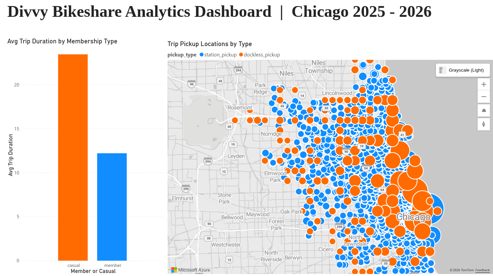

# Bikeshare Analytics Pipeline


## Motivation & Project Overview

Public bikeshare trip data is rich, but raw records are not ready for analytics out of the box. The source contains missing station values, mixed formats, and operational edge cases (especially for dockless electric bike behavior). Running analysis directly on raw data makes reporting brittle, expensive, and hard to trust.

This project builds an end-to-end batch Data Engineering pipeline that:

- Ingests monthly Divvy trip data from the source archive.
- Lands raw data in cloud storage and loads it into BigQuery raw tables.
- Transforms raw records into analytical dimensions/facts with dbt.
- Preserves business truth for dockless behavior (instead of force-imputing station IDs).

The final goal is to produce a reproducible analytics-ready warehouse model for downstream BI and decision-making.

## Problem Description

The core problem this project solves is converting raw monthly bikeshare extracts into a reliable analytical model while preserving business semantics.

Key issues addressed:

- Missing station IDs are common for electric bikes due to dockless pickup/drop-off behavior.
- Empty strings and mixed raw types require strict cleaning and standardization.
- Direct raw querying is not optimized for repeated BI workloads.
- Pipeline operations must be reproducible and cloud-deployable, not manual one-off scripts.

Business decision implemented:

- Do not impute nearest station IDs for missing electric-bike station values.
- Keep station IDs null where appropriate.
- Add explicit behavior labels (`pickup_type`, `dropoff_type`) to preserve analytical truth.

## Architecture Summary

The project follows a batch ELT architecture:

1. Source: Monthly Divvy zip files (`YYYYMM-divvy-tripdata.zip`).
2. Orchestration: Airflow DAG (`GCPIngestionDag`) runs monthly.
3. Data Lake: Parquet files uploaded to GCS (`raw/`).
4. Raw Warehouse: GCS -> BigQuery raw dataset table (`trips`).
5. Transformations: dbt models (staging -> intermediate -> marts).
6. Analytics Layer: Star-like marts with dimensions and a trips fact table.


## Cloud & IaC

Cloud platform and resources are managed on GCP.

Provisioning is handled with Terraform:

- `google_storage_bucket` for data lake landing zone.
- `google_bigquery_dataset` for raw ingestion dataset.
- Configurable project/location/credentials via `terraform/variables.tf`.

This satisfies cloud + IaC requirements for reproducible infrastructure setup.

## Batch Ingestion & Orchestration (Airflow)

The Airflow DAG (`airflow/dags/ingestion_dag.py`) orchestrates the full monthly flow:

- `download_data`: Download monthly zip from source URL.
- `format_to_parquet`: Extract CSV from zip and convert to Parquet.
- `upload_to_gcs`: Upload Parquet to GCS data lake path.
- `gcs_to_bigquery`: Load Parquet into BigQuery raw table.
- `cleanup`: Remove local temporary artifacts.
- `dbt_transformation`: Run dbt project transformations.

This is an end-to-end orchestrated batch pipeline (not partially manual).

## Data Warehouse Design

Warehouse layers are implemented in dbt:

- `staging`: Type casting, null standardization, and base cleaning.
- `intermediate`: Surrogate trip ID, deduplication policy, and business behavior flags.
- `marts`: Analytical dimensions/fact models.

Current marts:

- `dim_stations`
- `dim_location`
- `fct_trips`

Current report-serving models:

- `Report/operational_map_tile`
- `Report/membership_behaviour_tile`

`fct_trips` includes:

- Ride identifiers and station/location foreign keys
- Trip duration in minutes
- Geodesic distance (`trip_distance_meters`)
- Dockless/station behavior classification
- Incremental materialization with `merge` strategy on `trip_id`
- Partitioning by `started_at` (monthly) and clustering by `member_casual`, `rideable_type`

## Transformations (dbt)

Transformations are fully defined in dbt and include:

- Source definitions and documentation.
- Staging standardization (`NULLIF`, casts, timestamp normalization).
- Intermediate logic for `pickup_type` / `dropoff_type`.
- Fact/dimension joins in marts.
- Incremental fact loading in marts (`fct_trips`) to avoid full rebuilds every run.
- BigQuery performance optimization using partitioning and clustering in `fct_trips`.
- Data quality tests across intermediate and marts layers.

Test categories used:

- `not_null`, `unique`
- `relationships`
- `accepted_values`

## Dashboard

Dashboard integration is implemented as the serving layer for business reporting.

Current project state:

- Warehouse models and quality tests are in place.
- Two report tiles are live and connected to warehouse outputs:
   `operational_map_tile` and `membership_behaviour_tile`.
- Dashboard file is included under `Dashboard/`.

The marts layer is already connected to BI reporting through the live Power BI dashboard.

Live Dashboard Link:

- [View Live Power BI Dashboard](https://app.powerbi.com/groups/f22fa21b-9835-4618-a31e-d9148b7589d4/reports/a41cf92c-4bce-4475-85e0-3840c88f3edc?ctid=77255288-5298-4ea5-81aa-a13e604c30ac&pbi_source=linkShare)



## Repository Structure

```text
Bikeshare Analytics Pipeline/
├── airflow/
│   ├── dags/
│   │   └── ingestion_dag.py
│   ├── docker-compose.yaml
│   ├── Dockerfile
│   └── requirements.txt
├── Dashboard/
│   └── Bikeshare Dashboard.pbix
├── dbt/
│   └── bikeshare_pipeline/
│       ├── dbt_project.yml
│       ├── models/
│       │   ├── staging/
│       │   ├── intermediate/
│       │   └── marts/
│       │       └── Report/
│       │           ├── operational_map_tile.sql
│       │           └── membership_behaviour_tile.sql
│       ├── macros/
│       └── packages.yml
├── terraform/
│   ├── main.tf
│   └── variables.tf
```

Note: `keys/` is a local credentials directory and is gitignored (not committed).

## Setup & Reproducibility

### Prerequisites

Install the following locally:

- Terraform (v1.5+ recommended)
- Docker + Docker Compose
- Python 3.12 (for local dbt runs)
- dbt Core + `dbt-bigquery` (for local dbt runs)
- GCP service account key with access to BigQuery and GCS

### 1. Clone and prepare credentials

From the repository root:

```bash
git clone <your-repo-url>
cd "Bikeshare Analytics Pipeline"
```

Place your GCP key at:

```text
keys/my-creds.json
```

### 2. Configure Terraform variables

Terraform variables are already defined in `terraform/variables.tf`.
For a real deployment, update values to your own GCP project/bucket/dataset before `apply`.

If you are reviewing the project and do not have access to my GCP account, you can still validate infrastructure code locally with:

```bash
terraform init
terraform validate
terraform plan -refresh=false
```

This verifies the Terraform configuration without requiring access to existing cloud resources.

### 3. Provision cloud resources with Terraform

From `terraform/`:

```bash
terraform init
terraform plan
terraform apply
```

This creates:

- GCS bucket for raw data lake files
- BigQuery raw dataset for ingestion output

### 4. Configure dbt profile

Ensure local dbt profile exists at `~/.dbt/profiles.yml` with profile name:

```text
bikeshare_pipeline
```

It should point to your GCP project, use BigQuery, and reference the same key file.

### 5. Validate dbt locally

From `dbt/bikeshare_pipeline/`:

```bash
dbt deps
dbt debug
dbt run
dbt test
```

If this succeeds locally, your transformation layer is reproducible outside Airflow.

### 6. Configure Airflow environment

Create `airflow/.env` and set:

- `GCP_PROJECT_ID`
- `GCP_GCS_BUCKET`
- `BIGQUERY_DATASET`

The compose setup mounts:

- `../keys` -> `/opt/airflow/keys/credentials`
- `~/.dbt` -> `/opt/airflow/.dbt`
- `../dbt` -> `/opt/airflow/dbt`

So Airflow containers use the same dbt project and profiles.

### 7. Build and start Airflow

From `airflow/`:

```bash
docker-compose build --no-cache
docker-compose up -d
```

### 8. Run the pipeline end-to-end

In Airflow UI:

1. Trigger `GCPIngestionDag`.
2. Verify task order succeeds:
   `download_data -> format_to_parquet -> upload_to_gcs -> gcs_to_bigquery -> cleanup -> dbt_transformation`
3. Confirm output in BigQuery marts tables.

### 9. Re-run behavior (idempotency checks)

To verify reproducibility, run the DAG again for another logical date and confirm:

- Raw files are appended to lake/warehouse as expected.
- dbt models rebuild successfully.
- Tests pass consistently (`dbt test`).

### 10. Airflow and Power BI notes

Airflow:

- The DAG is included to show orchestration flow and reproducible task order.
- If you are only validating transformation logic, local `dbt run` and `dbt test` are enough.
- If you run Airflow, use the same env/profile mounts documented above so behavior matches local dbt.
- The final orchestration task runs dbt and builds marts/report models used by the dashboard tiles.

Power BI:

- The dashboard file is provided in `Dashboard/Bikeshare Dashboard.pbix`.
- Open it in Power BI Desktop and point data source credentials to your BigQuery project.
- Dashboard visuals are fed by marts + report models, especially `operational_map_tile` and `membership_behaviour_tile`.
- If BigQuery table names match this repo's dbt models, visuals should refresh with minimal changes.

## Final Notes

This project is designed as a production-style data engineering workflow, not just isolated SQL scripts. It combines:

- Cloud infrastructure provisioning,
- Orchestrated batch ingestion,
- Tested dbt transformations,
- And a marts layer powering live BI consumption.

## Future Enhancements

- Add a late-arriving data lookback window for incremental `fct_trips` loads (for example reprocessing the last N days).
- Add CI checks to run `dbt build` on pull requests.
